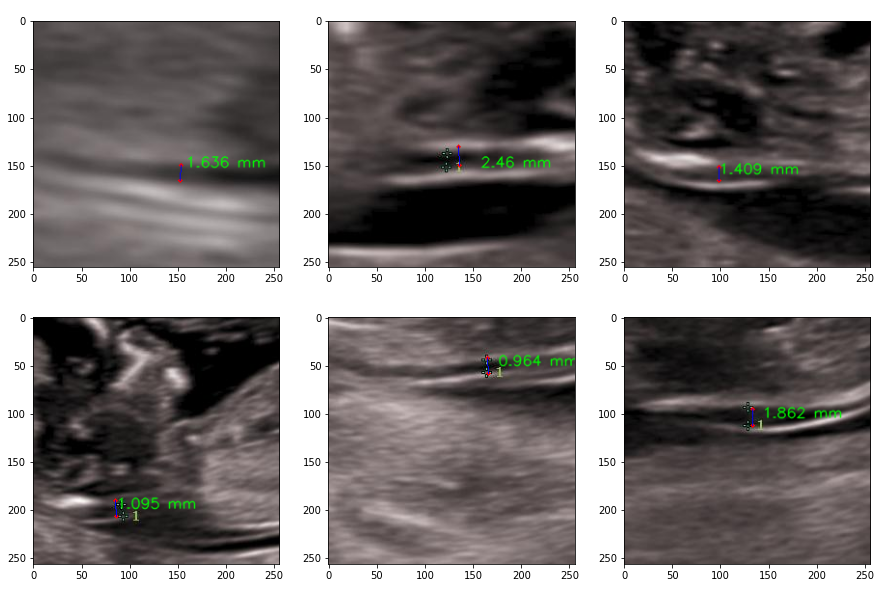
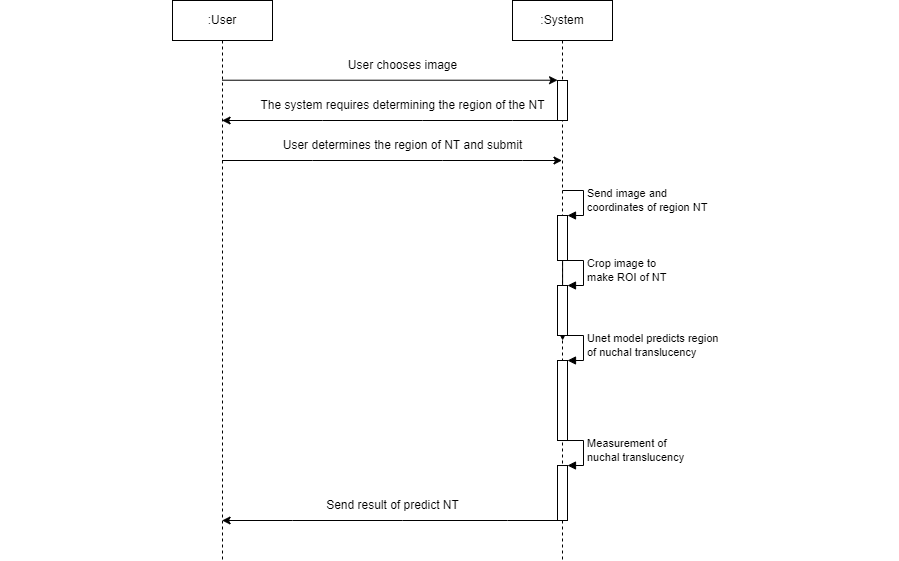
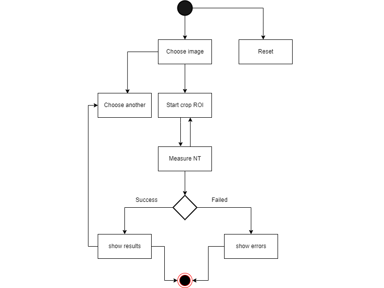
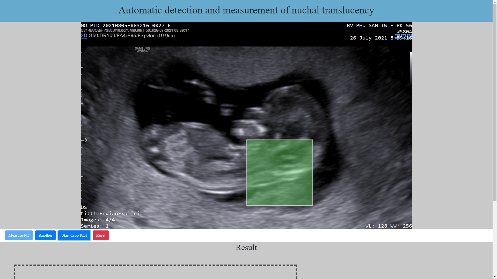
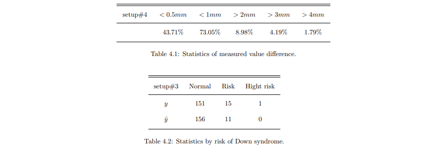

# Thesis - Method to automatic detection and measurement of nuchal translucency
## Introduction
Nuchal translucency is the fluid that accumulates under the nape of the fetus at 11-14 weeks of age, this opacity shown on the ultrasound image is the area between the two regions of bright echo. A nuchal translucency measurement is a tool for prenatal diagnostic analysis associated with congenital chromosomal disabilities such as Down syndrome.\
\
This thesis imitates the manual steps of a doctor during the process of determining the nuchal thickness to build a system that allows automatic analysis, determination, and measurement of nuchal translucency. The system is divided into 2 phases:
1. Segmentation to detect the nuchal translucency
2. Measurement of nuchal translucency
### Clear input and output
- Input: An MxNx3 matrix represents fetal ultrasound images.
- Output: Nuchal translucency (mm).\

## Background
The data set used includes 738 fetal ultrasound images provided by the central hospital of obstetrics and gynecology. However, up to 62.9% of the images were hidden causing data corruption, requiring preprocessing or using filtering and data enhancement methods. The labeling process is performed jointly by doctors.\

## Methodology
This thesis proposes a method to use the CNN Unet model to solve the first phase. and use image processing techniques to solve the second phase. Besides, it also uses data augmentation techniques to solve improved datasets.
### Segmentation
The Unet CNN model is used with enhancement in the output layer and feature extraction of the image, so that the output image is the same size as the input image, and is a binary image to match the second phase. Unet is a CNN network consisting of convolution layers, pooling, ... connected into two halves like an encoder and decoder block. However, unlike encoders and decoders, Unet classifies images on a pixel-by-pixel basis. Unet does not have a fully connected layer, instead, it uses short connections to join lossless guaranteed features. Input for Unet's training process according to Image2Image algorithm, input includes a pair of images (root, result).\

#### Loss function
The loss function used is the CrossEntropy function, but since unet classifies each pixel, the loss function is rewritten as follows:\
\
256 is the size of the input image.
## Experiments
The results of 3 experiments on data sets and with data augmentation technique are as follows:\
EXP1:\
\
EXP2:\
\
EXP3:\

### Measurement
In order to be suitable for calculation and according to the majority of subjective opinions, I define 2 NT points (nuchal translucency) located symmetrically through the center of the area of ​​the nape. The calculation process is described as follows:\
\
To perform unit conversion on pixel coordinates I use additional DPI property in image printing. Some illustrations of the results are as follows:\

## Deployment
To make the measurement process practical, I deployed the model to the web platform, with a basic user case to better illustrate the process of the system.\
\
\
\
See more in video here:\

## Results
Result of first phase.\
\
Result of second phase.\

## Conclusion
- The thesis has completed the requirements given.
- Will continue to improve further in the future.
